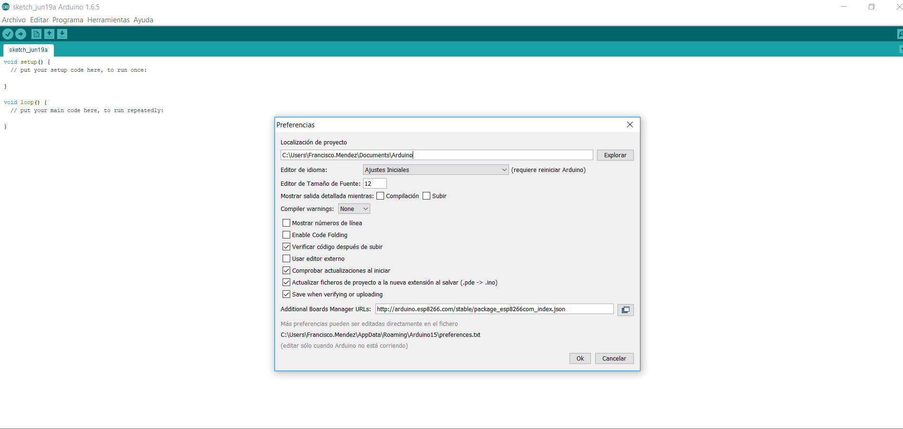
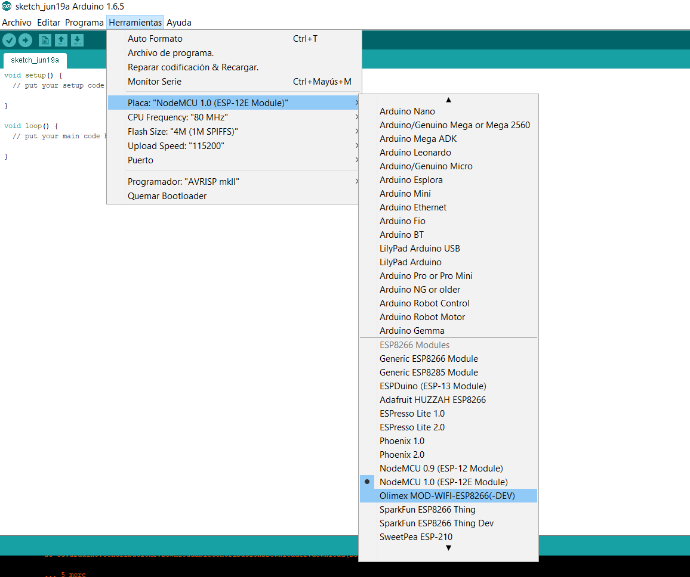

# {ing}tech_it : Configurando IDE Arduino

En esta sección vamos a configurar el IDE Arduino para programar la placa NODEMCU para enviar los datos que recibe la placa a través de los sensores, enviarla a Ubidots a través de la conexión WiFi que permite dicha placa.

La placa NODEMCU contiene integrado el modulo ESP8266 un pequeño chip que permite conectarse a través pasandole el SSID y la password de la red WiFi a la que nos queramos conectar.Debido a su bajo consumo y su pequeño tamaño debemos tener en cuenta que este chip tiene sus limitaciones tanto de ancho de banda como de distancia del router al que nos vayamos a conectar.

Para poder utilizar en nuestros código el modulo NODEMCU debemos instalar la librería ESP8266 (Realizado con la version Arduino 1.6.5):

1.Abrimos el IDE Arduino y le añadimos en Archivo-->Preferencia la url donde esta la placa "http://arduino.esp8266.com/stable/package_esp8266com_index.json", si ya tenemos algunas url en la casilla de .... ponemos una coma y pegamos la url para la placa esp8266.

2.Instalamos la placa en nuestro IDE: Herramientas->Board->Boards Manager y buscamos "ESP8266" y la instalamos.

3.Una vez instalado vamos a Herramientas->Board y seleccionamos "NodeMCU 1.0(ESP13Emodule)"

Para poder enviar datos a Ubidots utilizando la API que provee Ubidots tenemos que importar la libreria de Ubidots para el NODEMCU V1.0:

1.-Descargamos el ZIP de la librería de Ubidots para el chip ESP8266 desde ([Librería UbidotsMicroESP8266 ](https://github.com/ubidots/ubidots-nodemcu/archive/master.zip))

2.-Importamos la librería al IDE de Arduino para ello pulsamos en el IDE Programa -> Include Library -> Add .ZIP Library y seleccionamos el ZIP descargado.

---
Continuar al  [Paso 5](./programando_placa.md), [Volver](./ubidots.md) o ir al [Indice](./index.md)

