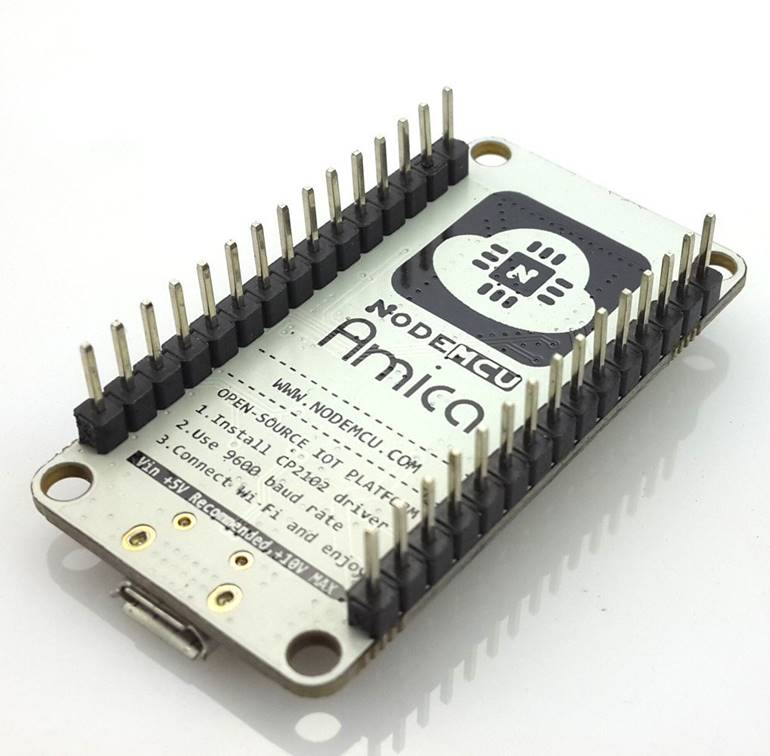
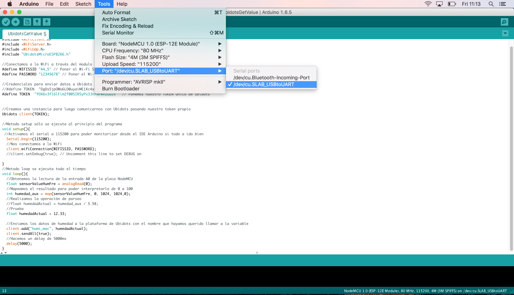

# {ing}tech_it : Placa NODEMCU V1.0

Una vez que tenemos la placa NODEMCU lo primero que tenemos que hacer es averiguar que chip lleva la placa que tenemos. Esto es importante debido a que está placa de desarrollo generalmente suele traer dos tipos de chip para ser programados, y en función del chip que tiene instalado deberemos instalar un driver u otro.

1.Descargando el driver para nuestra placa

Debido a que la placa NODEMCU V1.0 debemos leer en la propia placa que chip tiene instalado el CP2102 o el CH340, esto marca que driver debemos de instalar en nuestro PC para posteriormente programar la placa.

Descargar el driver del chip CP2102 (like [Driver CP2102](http://www.silabs.com/products/development-tools/software/usb-to-uart-bridge-vcp-drivers)).

Descargar el driver del chip CH340 (like [Driver CH340](http://sparks.gogo.co.nz/ch340.html)).

2.Probar si hemos instalado correctamente el chip de nuestra placa

Una vez instalado el driver en nuestro PC conectamos la placa con el cable micro usb y si hemos instalado correctamente el driver nos vamos al IDE de Arduino y podemos ver si el IDE ha reconocido correctamente el Arduino.

MAC

WINDOWS

---
Continuar al  [Paso 3](./ubidots.md) o volver [Indice](./index.md)

