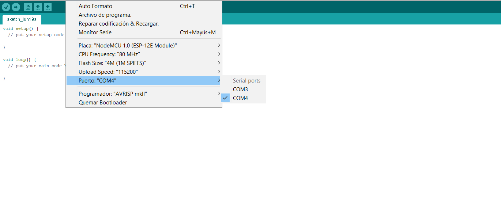

# {ing}tech_it : Programando Placa

Llegados a este punto ya tenemos lo necesario para poder implementar el circuito y programar la placa para enviar datos a Ubidots.

### Montaje del circuito (Desconectado del ordenador)

1.Colocamos la placa NODEMCU en la protaboard

2.Colocamos el sensor de humedad correctamente teniendo en cuenta que no os equivoquemos con los pines, debemos coger el controlador del sensor de humedad y conectar correctamente la señal analogica a la entrada A0 de la placa NODEMCU. Ahora conectamos la tensión VCC del controlador a los 3V de la placa NODEMCU y la salida GND del controlador GND de la placa NODEMCU.

3.-Revisamos que hemos conectado todo correctamente para no quemar el sensor y lo conectamos a nuestro ordeador.


### Programar la placa

Una vez tenemos conectado correctamente el circuito conectamos la placa NODEMCU a través del cable micro USB a nuestro PC y abrimos el IDE de Arduino.

1.Comprobamos que el IDE de Arduino a detectado la placa y que nosotros hemos seleccionado correctamente la placa en el IDE para programarla. Además tenemos que seleccioar el puerto correcto para programar la placa que hemos conectado, todas estas opciones estan en el IDE de Arduino en la pestaña Herramientas.



2.Creamos el Sketch que vamos a grabar en el NODEMCU con los datos de conexión a internet y nuestro Token de nuestro usuario de Ubidots. 

```bash
    //Añadimos las librerias necesarias
	#include <ESP8266WiFi.h>
	#include <WiFiClient.h>
	#include <WiFiClientSecure.h>
	#include <WiFiServer.h>
	#include <WiFiUdp.h>
	#include "UbidotsMicroESP8266.h"

	//Conectamos a la WiFi a través del modulo ESP8266 insertado en la placa NodeMCU v1.0
	#define WIFISSID "***************" // Poner el Wi-Fi SSID
	#define PASSWORD "***************" // Poner el Wi-Fi contraseña

	//Credenciales para enviar datos a Ubidots
	#define TOKEN  "****************************"  // Ponemos nuestro TOKEN único de Ubidots

	//Creamos una instancia para luego comunicarnos con Ubidots pasando nuestro token propio
	Ubidots client(TOKEN);

	//Metodo setup sólo se ejecuta al principio del programa
	void setup(){
	  //Activamos el serial a 115200 para poder monitorizar desde el IDE Arduino si todo a ido bien
	   Serial.begin(115200);
	   //Nos conectamos a la WiFi
	   client.wifiConnection(WIFISSID, PASSWORD);
	   //client.setDebug(true); // Uncomment this line to set DEBUG on

	}
	//Metodo loop se ejecuta todo el tiempo
	void loop(){
	   //Obtenemos la lectura de la entrada A0 de la placa NodeMCU
	   float sensorValueHumFre = analogRead(0);
	   //Mapeamos el resultado para poder interpretarlo de 0 a 100
	   int humedad_aux = map(sensorValueHumFre, 0, 1024, 1024,0);
	   //Realizamos la operación de parseo
	   float humedadActual = humedad_aux / 5.98;
	   
	   //Enviamos los datos de humedad a la plataforma de Ubidots con el nombre que hayamos querido llamar a la variable
	   client.add("humi", humedadActual);
	   client.sendAll(true);
	   //Hacemos un delay de 5000ms
	   delay(5000);
	}
```

3.Leer la salida serial de la placa NODEMCU para ver si se conecta a Internet a través del punto de acceso a Internet, para ello una vez que hemos cargado el programa correctamente y nos ha salido en la consola del IDE de Arduino que todo ha ido correctamente y se ha cargado 100% del programa, le damos en la pestaña superior Herramientas->Monitor Serie y deberiamos ver un 'OK', esto significa que se ha conectado a internet y que esta enviando datos a Ubidots si en el código hemos añadido nuestro Token de Ubidots.


4.Ver en Ubidots con nuestra cuenta si nos estan llegando datos, sino tenemos maceta podemos simular los datos.

Accedemos en Ubidots con nuestra cuenta y nos debe salir en la pestaña de Devices un nuevo dispositivo con una variable que es la humedad que esta enviando nuestra placa cada 5000ms.


### Sustituir la fuente de alimentación por una Pila de 9V.


---
Continuar al  [Paso 6](./visualizando_datos.md), [Volver](./configurando_ide_arduino.md) o ir al [Indice](./index.md)


