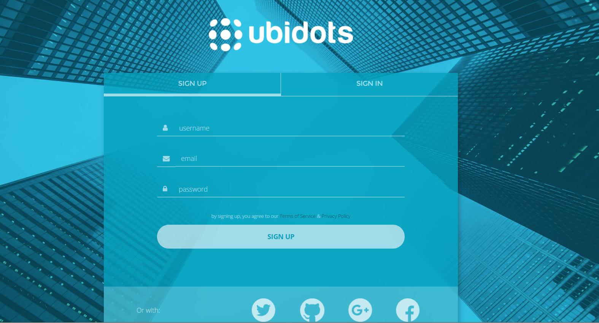
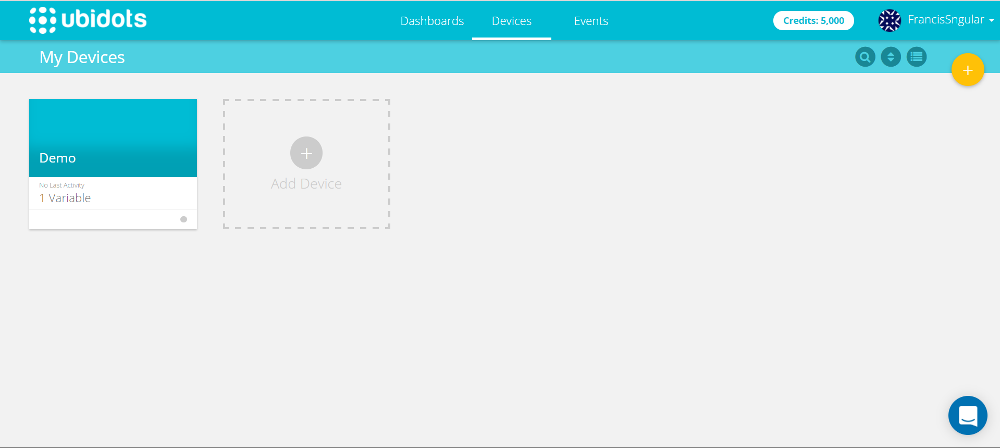
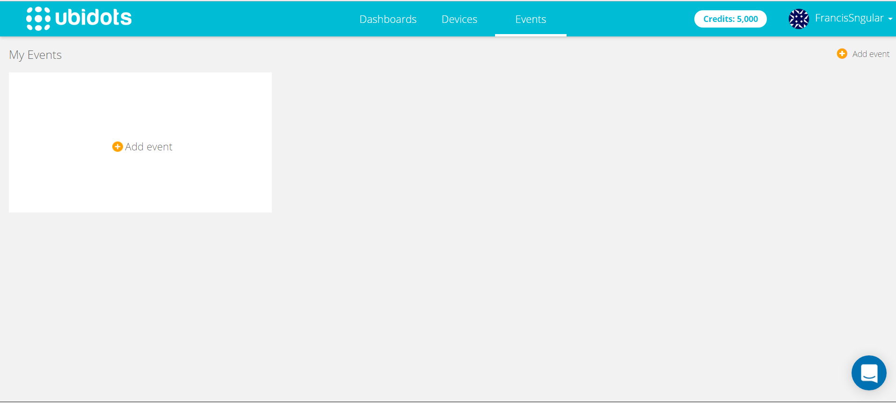
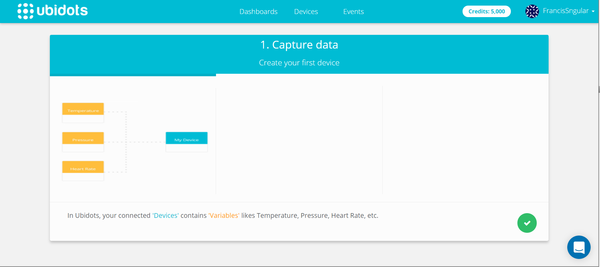

# {ing}tech_it : Ubidots

### Introducción

Ubidots es una plataforma con un bajo coste que nos provee de un Dashboard para alojar los datos de nuestros sensores sin que nosotros nos preocupemos de tener que desarrollar una plataforma para monitorizar toda la información que proveen nuestros sensores.

Ubidots destaca por su facilidad de uso y sobre todo porque tiene una documentación excelente para conectar nuestros dispositivos a la plataforma con código de ejemplo. Además de permitir conectar una extensa variedad de dispositivos ([Dispositivos Ubidots ](https://ubidots.com/docs/devices/index.html#devices) también permite comunicarse con nuestros dispositivo con protocolos muy utilizados en el IoT y IIoT como es MQTT.

Ubidots permite activar alarmas de nuestros sensores, localiza nuestros dispositivos y configurar a tu gusto un gran Dashboard para poder controlar lo que quieras de tus sensores.
(https://ubidots.com/img/Gifs_Home/step-2-dashboard.gif)

Una hemos introducido Ubidots vamos ha utilizarlo y para ello lo primero es darnos de alta si aún no tenemos cuenta. ([Login Ubidots ](https://app.ubidots.com/accounts/signup/)

Una vez hemos accedido a la plataforma con nuestro usuario debemos tener en cuenta algunos aspectos:

1.Ubidots no es gratis pero inicialmente nos da un saldo 5,000 para utilizarlo por un tiempo.

2.Ubidots permite crear dispositivos y variables en esos dispositivos lo que permite enviar los datos de sensores especificos

3.(Usaremos en este taller)Ubidots nos provee de un TOKEN único para nuestro usuario lo que nos permite enviar datos desde cualquier dispositivo conectado a Internet.

4.Ubidots permite poner alarmas o eventos que nos envien correo electronico cuando un sensor no esta en los valores que deseamos, por ejemplo.

### Obteniendo el Token de nuestro usuario

1.Accedemos a Ubidots ([Login Ubidots ](https://app.ubidots.com/accounts/signin/)

2.Obtenemos el Token que utilizaremos en la placa NODEMCU V1.0 

---
Continuar al  [Paso 4](./configurando_ide_arduino.md) o volver [Indice](./index.md)

